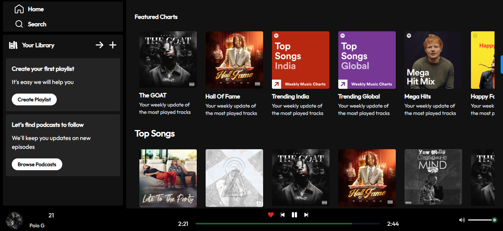
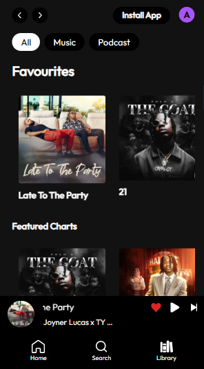

## Overview

### The challenge

Users should be able to:

- Play Songs
- View Albums
- Add to Favourites

### Screenshot

Desktop View

Mobile View

### Links

- Live Site URL: [Add live site URL here](https://your-live-site-url.com)

## My process

### Built with

- Semantic HTML5 markup
- CSS custom properties
- React.js
- Tailwind Css
- Redux Toolkit
- Mobile-first workflow
- [React](https://reactjs.org/) - JS library
- [TailwindCss](https://tailwindcss.com/) - CSS framework

### What I learned

I learnt how to use Redux for state management

### Continued development

I will love to evolve in my Redux State Management

## Author

- Website - [Add your name here](https://www.your-site.com)
- Frontend Mentor - [@yourusername](https://www.frontendmentor.io/profile/yourusername)
- Twitter - [@yourusername](https://www.twitter.com/yourusername)

**Note: Delete this note and add/remove/edit lines above based on what links you'd like to share.**

## Acknowledgments

A big shout out to GreatStack Tutorials for being a huge guide throughout this project.
# Musicora
