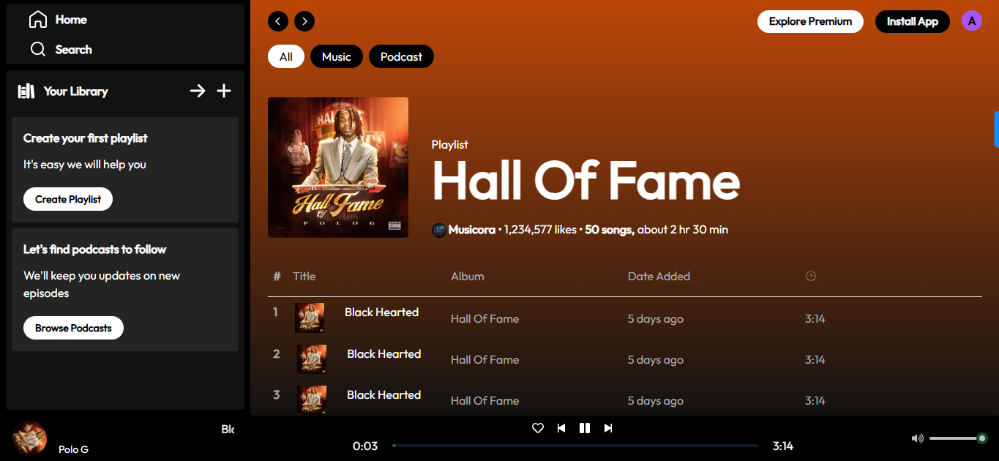

## Overview

### The challenge

Users should be able to:

- Play Songs
- View Albums
- Add to Favourites

### Screenshot

Desktop View

Mobile View

### Links

- Live Site URL: https://musicora.vercel.app

## My process

### Built with

- Semantic HTML5 markup
- CSS custom properties
- React.js
- Tailwind Css
- Redux Toolkit
- Mobile-first workflow
- [React](https://reactjs.org/) - JS library
- [TailwindCss](https://tailwindcss.com/) - CSS framework

### What I learned

I learnt how to use Redux for state management.

### Continued development

I will love to evolve in my Redux State Management.

## Author

- Website - https://musicora.vercel.app
- Frontend Mentor - @johnedokpolor

## Acknowledgments

A big shout out to GreatStack Tutorials for being a huge guide throughout this project.
